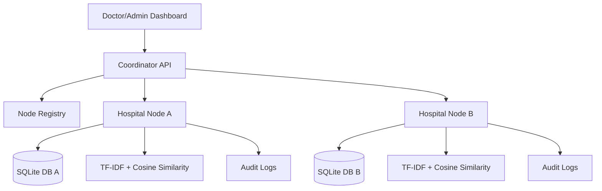
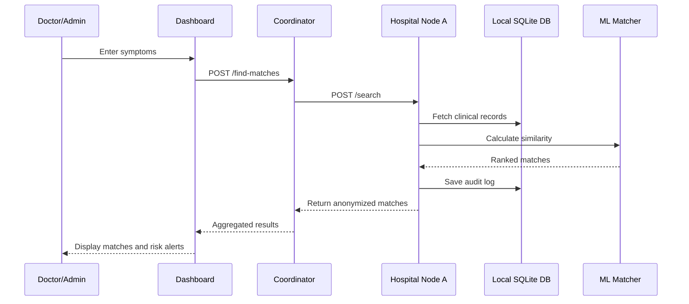
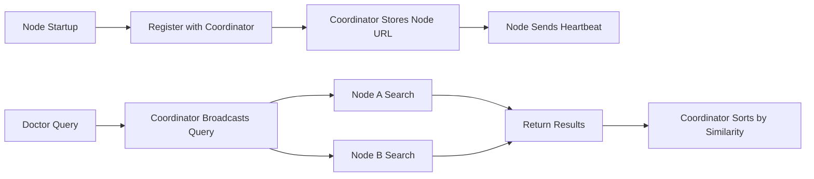
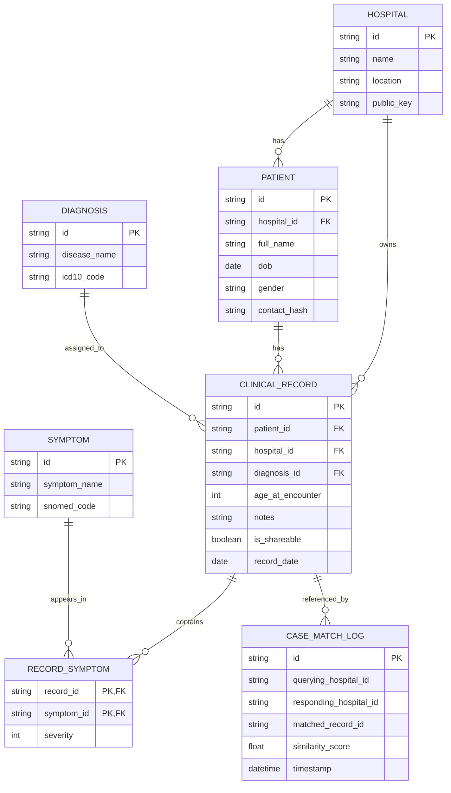

# Secure Distributed Clinical Rare Disease Case Matching System

Complete project documentation, execution guide, demo guide, viva preparation, and placement explanation.

---

## 1. Complete Project Overview

### 1.1 Problem Statement

Rare diseases are difficult to diagnose because each disease affects only a small number of patients. A doctor in one hospital may see only one or two similar cases in many years. Useful matching records may exist in other hospitals, but hospitals usually keep patient data in separate local databases for privacy, legal, and operational reasons.

This project solves that problem by building a distributed clinical case matching system. Each hospital keeps its own database locally. A central coordinator sends symptom queries to registered hospital nodes. Each node searches its own clinical records using machine learning and returns only anonymized matching results.

### 1.2 Why Rare Disease Diagnosis Is Difficult

- Symptoms overlap with common diseases.
- Many rare diseases have non-specific early symptoms such as fever, fatigue, rash, seizures, or weakness.
- Doctors may not have enough historical cases in one hospital.
- Rare disease data is scattered across institutions.
- Patient privacy prevents hospitals from directly sharing full records.
- Diagnosis may require pattern recognition across symptoms, severity, notes, and history.

### 1.3 Why Distributed Databases Are Needed

A single centralized database is not always realistic in healthcare because:

- Hospitals own and control their own patient records.
- Patient privacy regulations restrict raw data sharing.
- Different hospitals may use independent local systems.
- A distributed system allows local storage and global search.
- Each node can participate without giving up its full database.

In this project, every hospital node has its own SQLite database. The coordinator does not store full patient records. It only broadcasts queries and aggregates anonymized results.

### 1.4 Why Machine Learning Is Used

Exact keyword matching is weak for clinical data. For example:

- "high temperature" should match "fever"
- "small head" should match "microcephaly"
- "fits" should match "seizures"

Machine learning helps by converting symptoms and notes into numerical vectors and measuring similarity between the query and existing cases. This project uses:

- TF-IDF for feature extraction
- Cosine similarity for ranking matches
- Symptom synonym handling
- Severity-based weighting
- Explainable matching output

### 1.5 Real-World Impact

This kind of system can help:

- Doctors find similar rare disease cases faster.
- Hospitals collaborate without exposing raw patient identity.
- Medical researchers detect repeated rare disease patterns.
- High-risk cases receive faster attention.
- Healthcare networks discover disease hotspots.

### 1.6 Why This Project Is Unique

Most DBMS mini projects are simple CRUD systems such as hospital management, library management, or student records. This project is stronger because it combines:

- DBMS schema design
- SQLAlchemy ORM
- Distributed system architecture
- FastAPI microservices
- Machine learning similarity search
- Privacy protection
- Audit logging
- Healthcare dashboard
- Docker-based deployment

It is not only a database project. It is a complete applied system.

---

## 2. Complete Architecture Explanation

### 2.1 High-Level Architecture

The system has four main layers:

1. Frontend Dashboard
2. Coordinator Service
3. Hospital Node Services
4. Local Hospital Databases and ML Engine

### 2.2 Main Components

#### Coordinator

The coordinator is the central communication controller. It does not store patient records. Its job is to:

- Register hospital nodes
- Maintain active node list
- Receive heartbeat messages
- Broadcast symptom queries
- Aggregate and rank results
- Serve the frontend dashboard

Important files:

- `coordinator/main.py`
- `coordinator/registry.py`

#### Hospital Node

A hospital node represents one hospital participating in the network. It owns:

- Local SQLite database
- Search API
- ML matching engine
- Analytics endpoints
- Audit logs

Important files:

- `node/main.py`
- `node/core/matching.py`
- `node/core/analytics.py`
- `node/core/crypto.py`

#### Database Layer

The database layer uses SQLAlchemy models and SQLite. It stores:

- Hospitals
- Patients
- Symptoms
- Diagnoses
- Clinical records
- Record-symptom relationships
- Audit logs

Important files:

- `shared/database.py`
- `shared/models.py`
- `shared/seed_data.py`

#### ML Engine

The ML engine converts symptoms and notes into TF-IDF vectors and calculates cosine similarity between a doctor query and stored clinical records.

Important file:

- `node/core/matching.py`

#### Frontend

The frontend is a lightweight HTML/CSS/JavaScript dashboard served by the coordinator.

Important files:

- `frontend/index.html`
- `frontend/styles.css`
- `frontend/app.js`

#### Docker Layer

Docker Compose defines:

- One coordinator container
- Multiple hospital node containers
- Persistent SQLite volumes

Important files:

- `docker-compose.yml`
- `coordinator/Dockerfile`
- `node/Dockerfile`

### 2.3 Mermaid Architecture Diagram



### 2.4 Component Interaction Diagram



### 2.5 Request Lifecycle

1. Doctor logs into dashboard.
2. Doctor enters symptoms, severity, and optional notes.
3. Dashboard sends request to coordinator `/find-matches`.
4. Coordinator checks active registered nodes.
5. Coordinator sends the same query to every active node.
6. Each node searches its local database.
7. ML engine ranks similar clinical records.
8. Node returns anonymized result data.
9. Coordinator merges results from all nodes.
10. Dashboard displays suspected disease, score, confidence, hospital source, and explanation.

### 2.6 Distributed Communication Flow



---

## 3. Database Explanation

### 3.1 Database Tables

The database schema is defined in `shared/models.py`.

### 3.2 Hospital Table

Purpose:

Stores hospital information.

Fields:

- `id`: Primary key
- `name`: Hospital name
- `location`: Hospital location
- `public_key`: Placeholder for secure communication key

Relationships:

- One hospital has many patients.
- One hospital has many clinical records.

### 3.3 Patient Table

Purpose:

Stores patient demographic details.

Fields:

- `id`: Primary key
- `hospital_id`: Foreign key to Hospital
- `full_name`: Patient name
- `dob`: Date of birth
- `gender`: Gender
- `contact_hash`: SHA-256 hashed contact data

Privacy:

Patient contact information is not stored directly. It is hashed.

### 3.4 Diagnosis Table

Purpose:

Stores diagnosis details.

Fields:

- `id`: Primary key
- `disease_name`: Disease name
- `icd10_code`: Standard medical diagnosis code

Relationship:

- One diagnosis can be linked to many clinical records.

### 3.5 Symptom Table

Purpose:

Stores symptoms in normalized form.

Fields:

- `id`: Primary key
- `symptom_name`: Symptom name
- `snomed_code`: Standard symptom code

Relationship:

- One symptom can appear in many records.

### 3.6 ClinicalRecord Table

Purpose:

Stores one medical encounter or case record.

Fields:

- `id`: Primary key
- `patient_id`: Foreign key to Patient
- `hospital_id`: Foreign key to Hospital
- `diagnosis_id`: Foreign key to Diagnosis
- `age_at_encounter`: Patient age during visit
- `notes`: Clinical notes
- `is_shareable`: Whether record can be used for matching
- `record_date`: Date of record

### 3.7 RecordSymptom Table

Purpose:

Handles many-to-many relationship between clinical records and symptoms.

Why needed:

- One clinical record can have many symptoms.
- One symptom can appear in many clinical records.

Fields:

- `record_id`: Foreign key to ClinicalRecord
- `symptom_id`: Foreign key to Symptom
- `severity`: Severity from 1 to 5

Primary key:

- Composite key: `record_id + symptom_id`

### 3.8 CaseMatchLog Table

Purpose:

Stores anonymized audit logs whenever matching is performed.

Fields:

- `id`: Primary key
- `querying_hospital_id`
- `responding_hospital_id`
- `matched_record_id`
- `similarity_score`
- `timestamp`

### 3.9 ER Diagram



### 3.10 Normalization and 3NF

The schema follows 3NF because:

- Each table stores one type of entity.
- Non-key attributes depend only on the primary key.
- Repeating data is separated into independent tables.
- Symptoms are not repeated as comma-separated strings.
- Diagnoses are stored separately from clinical records.
- Many-to-many symptom relationships are handled through `RecordSymptom`.

Redundancy avoided:

- Hospital details are stored once in Hospital table.
- Symptom names are stored once in Symptom table.
- Diagnosis names are stored once in Diagnosis table.
- Clinical records reference these tables using foreign keys.

---

## 4. Machine Learning Explanation

### 4.1 Beginner Explanation

The system compares the symptoms entered by a doctor with symptoms stored in previous clinical records. Instead of checking only exact words, it converts text into numbers and calculates how similar two cases are.

### 4.2 What Is TF-IDF?

TF-IDF means Term Frequency-Inverse Document Frequency.

It gives importance to words based on:

- How often a word appears in a record.
- How unique that word is across all records.

Example:

- Common words are less important.
- Specific medical symptoms become more important.

### 4.3 Why TF-IDF Is Used

TF-IDF is simple, fast, explainable, and suitable for text-based symptom matching. It works well for a mini project because symptoms and notes are text data.

### 4.4 What Is Cosine Similarity?

Cosine similarity measures the angle between two vectors.

- Similar vectors have a small angle.
- Dissimilar vectors have a large angle.
- Score ranges from 0 to 1.

In this project:

- Query symptoms become one vector.
- Each clinical record becomes another vector.
- Cosine similarity calculates how close they are.

### 4.5 How Symptom Vectors Are Created

For each clinical record:

1. Symptoms are collected.
2. Severe symptoms are repeated to increase weight.
3. Diagnosis name is added.
4. Clinical notes are added.
5. TF-IDF converts the text into a vector.

For the query:

1. User symptoms are normalized.
2. Synonyms are converted.
3. Severity is used as weight.
4. Notes are added.
5. Query is converted into a vector.

### 4.6 Confidence and Risk

Similarity score is converted into a readable confidence percentage.

Example:

```text
similarity_score = 0.656
confidence_score = 65.6%
```

Risk level is generated using:

- Similarity score
- Number of matched symptoms
- Rare disease probability
- Severity values

Risk levels:

- LOW
- MEDIUM
- HIGH
- CRITICAL

### 4.7 Explainable Matching

The system returns why a match happened.

Example:

```text
Matched due to shared symptoms: Fever, Microcephaly, Seizures
```

This is important because doctors and examiners need interpretability, not just a number.

### 4.8 Interview Explanation

This project uses TF-IDF to extract numerical features from symptom and clinical note text. Each clinical record becomes a vector. The query symptoms also become a vector. Cosine similarity ranks records by vector similarity. The top records are returned with confidence score, matched symptoms, disease name, and risk alert.

---

## 5. Security Explanation

### 5.1 Why Patient Privacy Matters

Healthcare data is sensitive. Patient identity, contact details, symptoms, and diagnosis must be protected. A distributed design reduces privacy risk because raw patient records stay inside hospital nodes.

### 5.2 SHA-256 Hashing

SHA-256 is a one-way cryptographic hashing algorithm. In this project, patient contact data is hashed before storage.

Example:

```text
email -> SHA-256 hash
```

The system stores the hash, not the original contact value.

### 5.3 Anonymization

Search results do not return full patient names or contact details. They return:

- Record ID
- Hospital name
- Disease name
- Match score
- Risk level

### 5.4 Role-Based Access

Protected APIs require:

```text
X-API-Key: SUPER_SECURE_RARE_DISEASE_NETWORK_KEY_2026
X-Role: admin
```

Roles:

- `admin`: can access analytics and audit logs
- `clinician`: can search and view clinical matching data

### 5.5 Audit Logging

Every successful match creates a log entry. This helps track:

- Which hospital queried
- Which node responded
- Which record matched
- Similarity score
- Timestamp

### 5.6 Secure Distributed Communication

Coordinator-to-node communication includes API key and role headers. Nodes reject unauthorized requests.

---

## 6. Complete File and Folder Explanation

### `coordinator/main.py`

Purpose:

Defines the coordinator FastAPI application.

Main functionality:

- Health check
- Node registration
- Heartbeat handling
- Distributed search
- Network summary
- Network analytics aggregation
- Serves dashboard

Important endpoints:

- `/`
- `/nodes`
- `/register`
- `/heartbeat`
- `/find-matches`
- `/network-summary`
- `/network-analytics`
- `/dashboard`

### `coordinator/registry.py`

Purpose:

Maintains active hospital node registry.

Important class:

- `NodeRegistry`

Important methods:

- `register_node`
- `heartbeat`
- `deregister_node`
- `get_active_nodes`
- `get_active_node_details`

### `coordinator/Dockerfile`

Purpose:

Builds coordinator container.

Includes:

- Python dependencies
- Coordinator code
- Shared code
- Frontend files

### `node/main.py`

Purpose:

Defines hospital node FastAPI application.

Main functionality:

- Registers with coordinator
- Sends heartbeat
- Lists symptoms
- Lists cases
- Searches local records
- Returns audit logs
- Provides analytics endpoints

Important endpoints:

- `/`
- `/status-summary`
- `/symptoms`
- `/cases`
- `/search`
- `/audit-logs`
- `/analytics/hotspots`
- `/analytics/symptom-evolution`
- `/analytics/duplicates`
- `/analytics/rare-patterns`
- `/analytics/risk-alerts`

### `node/core/matching.py`

Purpose:

Contains ML matching logic.

Important items:

- `SYNONYM_DICT`
- `normalize_symptoms`
- `MLMatcher`
- `find_matches`

Uses:

- `TfidfVectorizer`
- `cosine_similarity`

### `node/core/analytics.py`

Purpose:

Contains advanced analytics features.

Important functions:

- `disease_hotspots`
- `symptom_evolution`
- `duplicate_cases`
- `rare_patterns`
- `emergency_alerts`

### `node/core/crypto.py`

Purpose:

Contains security helper functions.

Important functions:

- `hash_patient_pii`
- `verify_api_key`
- `require_role`

### `node/Dockerfile`

Purpose:

Builds hospital node container.

### `shared/database.py`

Purpose:

Creates SQLAlchemy engine, session, and base model.

Important items:

- `SQLALCHEMY_DATABASE_URL`
- `engine`
- `SessionLocal`
- `Base`
- `get_db`

### `shared/models.py`

Purpose:

Defines all SQLAlchemy ORM models.

Models:

- `Hospital`
- `Patient`
- `Diagnosis`
- `Symptom`
- `ClinicalRecord`
- `RecordSymptom`
- `CaseMatchLog`

### `shared/schemas.py`

Purpose:

Defines Pydantic request and response models.

Important schemas:

- `MatchRequest`
- `MatchDetail`
- `MatchResponse`
- `NodeRegistration`
- `HeartbeatRequest`

### `shared/seed_data.py`

Purpose:

Creates database tables and inserts realistic sample data.

### `seed_data.py`

Purpose:

Root-level shortcut to run database seeding.

Command:

```powershell
python seed_data.py
```

### `setup_db.py`

Purpose:

Creates database tables without seed records.

### `smoke_test.py`

Purpose:

Quick test for node health, symptoms, and ML search.

### `integration_test.py`

Purpose:

Complete validation script for:

- Node health
- Symptom loading
- ML search
- Security rejection
- Risk analytics
- Coordinator health
- Optional live distributed test

### `frontend/index.html`

Purpose:

Dashboard page structure.

Contains:

- Login page
- Dashboard cards
- Search form
- Results view
- Analytics view
- Audit logs table

### `frontend/styles.css`

Purpose:

Medical dashboard styling.

### `frontend/app.js`

Purpose:

Frontend API calls and UI logic.

### `docker-compose.yml`

Purpose:

Runs coordinator and multiple hospital nodes using Docker.

### Documentation Files

- `README.md`
- `API_DOCUMENTATION.md`
- `DEMO_SCRIPT.md`
- `VIVA_PREP.md`
- `RESUME_DESCRIPTION.md`
- `PROJECT_DOCUMENTATION_COMPLETE.md`

---

## 7. How to Run the Project

### 7.1 Prerequisites

Install:

- Python 3.10 or above
- pip
- VS Code
- Optional: Docker Desktop

### 7.2 Open Project Folder

```powershell
cd "C:\Users\Nityashree\OneDrive\Desktop\BNMIT\PROJECTS\Rare Disease Matcher"
```

### 7.3 Create Virtual Environment

```powershell
python -m venv .venv
```

Activate:

```powershell
.\.venv\Scripts\Activate.ps1
```

If PowerShell blocks activation:

```powershell
Set-ExecutionPolicy -Scope Process -ExecutionPolicy Bypass
.\.venv\Scripts\Activate.ps1
```

### 7.4 Install Dependencies

```powershell
pip install -r requirements.txt
```

### 7.5 Seed Database

```powershell
python seed_data.py
```

Expected output:

```text
Seeded database with 2 hospitals, 4 patients, 10 symptoms, and 4 clinical records.
```

### 7.6 Run Tests

```powershell
python smoke_test.py
```

```powershell
python integration_test.py
```

Expected:

```text
PASS: node health
PASS: symptoms loaded
PASS: node ML search
PASS: zika top result
PASS: risk alert generated
PASS: security rejects missing key
PASS: risk analytics
PASS: coordinator health
All integration checks completed.
```

### 7.7 Start Coordinator

Terminal 1:

```powershell
python -m uvicorn coordinator.main:app --reload --port 8000
```

Expected:

```text
Uvicorn running on http://127.0.0.1:8000
Application startup complete.
```

### 7.8 Start Hospital Node A

Terminal 2:

```powershell
$env:NODE_ID="HOSPITAL_A"
$env:NODE_URL="http://127.0.0.1:8001"
$env:COORDINATOR_URL="http://127.0.0.1:8000"
python -m uvicorn node.main:app --reload --port 8001
```

Expected:

```text
Registration response: 200
Uvicorn running on http://127.0.0.1:8001
```

### 7.9 Optional Hospital Node B

Terminal 3:

```powershell
$env:NODE_ID="HOSPITAL_B"
$env:NODE_URL="http://127.0.0.1:8002"
$env:COORDINATOR_URL="http://127.0.0.1:8000"
$env:DATABASE_URL="sqlite:///./hospital_b.db"
python -m uvicorn node.main:app --reload --port 8002
```

### 7.10 URLs to Open

Coordinator:

```text
http://127.0.0.1:8000
http://127.0.0.1:8000/nodes
http://127.0.0.1:8000/dashboard
http://127.0.0.1:8000/docs
```

Hospital Node A:

```text
http://127.0.0.1:8001
http://127.0.0.1:8001/symptoms
http://127.0.0.1:8001/docs
```

### 7.11 Dashboard Login

Open:

```text
http://127.0.0.1:8000/dashboard
```

Use:

```text
Role: Admin
API Key: SUPER_SECURE_RARE_DISEASE_NETWORK_KEY_2026
```

### 7.12 Test Distributed Search

```powershell
$response = Invoke-RestMethod -Uri "http://127.0.0.1:8000/find-matches" `
  -Method POST `
  -ContentType "application/json" `
  -Body '{"symptoms":["high temperature","seizures","small head"],"severity":{"fever":5,"seizures":5,"microcephaly":5},"notes":"infant case with neurological symptoms","top_k":3}'

$response.results | Format-List
```

Expected top result:

```text
Congenital Zika Syndrome
Matched symptoms: Fever, Microcephaly, Seizures
Risk: HIGH or CRITICAL
```

### 7.13 Docker Version

Only if Docker Desktop is installed:

```powershell
docker compose up --build
```

Check:

```powershell
docker compose ps
```

Stop:

```powershell
docker compose down
```

Reset volumes:

```powershell
docker compose down -v
```

---

## 8. Panel Demo Flow

### 8.1 Best Demo Scenario

Use this query:

```text
high temperature, seizures, small head
```

Severity:

```text
Critical
```

Expected result:

```text
Congenital Zika Syndrome
Matched symptoms: Fever, Microcephaly, Seizures
High/critical risk
```

### 8.2 Demo Steps

1. Open project folder in VS Code.
2. Show folder structure.
3. Start coordinator on port 8000.
4. Start hospital node on port 8001.
5. Open `/nodes` and show hospital node registration.
6. Open dashboard.
7. Login as admin.
8. Show active nodes and record count.
9. Enter symptoms in search form.
10. Show ML match result.
11. Explain confidence score and matched symptoms.
12. Open analytics tab.
13. Show disease hotspots, rare patterns, risk alerts, and timeline.
14. Open audit logs.
15. Open Swagger docs.
16. Run `integration_test.py`.

### 8.3 What to Highlight

- Distributed architecture
- Local hospital databases
- Privacy-preserving design
- TF-IDF and cosine similarity
- Explainable result
- API security
- Audit logging
- Analytics features

---

## 9. Viva Preparation

### 9.1 General Questions

1. What is your project about?

Answer: It is a secure distributed rare disease case matching system where hospital nodes store local patient data and a coordinator broadcasts symptom queries to find similar rare disease cases using ML.

2. Why did you choose this project?

Answer: It combines DBMS, ML, distributed systems, and healthcare privacy, making it more realistic than a basic CRUD project.

3. What is the main problem solved?

Answer: It helps doctors find similar rare disease cases across hospitals without centralizing sensitive patient data.

4. What is the main output?

Answer: Ranked rare disease matches with confidence score, matched symptoms, hospital source, and risk level.

5. Is this production-ready?

Answer: It is a demo-ready academic prototype. Production would need stronger authentication, encryption, and larger datasets.

### 9.2 DBMS Questions

6. Which database is used?

Answer: SQLite is used for simplicity, with SQLAlchemy ORM for database operations.

7. Why SQLAlchemy?

Answer: It provides object-relational mapping, cleaner queries, model relationships, and database portability.

8. What is the primary key in ClinicalRecord?

Answer: `id`.

9. What is the purpose of RecordSymptom?

Answer: It handles the many-to-many relationship between clinical records and symptoms and stores symptom severity.

10. Is your database normalized?

Answer: Yes. It follows 3NF because hospitals, patients, symptoms, diagnoses, and records are separated into independent tables.

11. How is redundancy avoided?

Answer: Repeated data such as symptom names and diagnosis names are stored once and referenced using foreign keys.

12. What is an audit log?

Answer: It is a record of search/match events for traceability.

### 9.3 ML Questions

13. What ML algorithm is used?

Answer: TF-IDF vectorization with cosine similarity.

14. What is TF-IDF?

Answer: TF-IDF gives numerical importance to words based on their frequency in one document and rarity across all documents.

15. Why cosine similarity?

Answer: It measures similarity between symptom vectors and works well for text-based matching.

16. How is confidence calculated?

Answer: The cosine similarity score is converted to a percentage.

17. How do synonyms work?

Answer: A synonym dictionary maps user-friendly terms to medical terms, such as "high temperature" to "fever".

18. Why not deep learning?

Answer: TF-IDF is simpler, explainable, lightweight, and suitable for a 4th semester prototype.

### 9.4 Distributed Systems Questions

19. What makes the system distributed?

Answer: Multiple hospital nodes run independently with local databases, and the coordinator communicates with them over HTTP.

20. What is node registration?

Answer: When a hospital node starts, it sends its ID and URL to the coordinator.

21. What is heartbeat?

Answer: A periodic message from node to coordinator to show that the node is alive.

22. What happens if a node is offline?

Answer: Coordinator removes inactive nodes after timeout and does not query them.

23. Why async communication?

Answer: It lets the coordinator query multiple hospital nodes in parallel.

### 9.5 Security Questions

24. How is patient privacy protected?

Answer: Raw patient contact data is hashed, full identity is not returned in match results, and protected APIs require API key and role headers.

25. What is SHA-256?

Answer: It is a cryptographic hash function that converts input data into a fixed-size irreversible hash.

### 9.6 Difficult External Questions

Question: Can cosine similarity replace medical diagnosis?

Answer: No. It only assists doctors by finding similar cases. Final diagnosis must be made by qualified clinicians.

Question: What if two hospitals use different terms?

Answer: The project includes synonym handling. In future, standard ontologies like SNOMED CT can improve this.

Question: What is the biggest limitation?

Answer: Small demo dataset and basic authentication. The architecture is extensible for larger datasets and stronger security.

Question: Why not centralize all records?

Answer: Centralization creates privacy, ownership, and compliance issues. Distributed search keeps data local.

---

## 10. Debugging and Troubleshooting

### 10.1 `ModuleNotFoundError`

Reason:

Dependencies are not installed or virtual environment is not active.

Fix:

```powershell
pip install -r requirements.txt
```

### 10.2 `uvicorn is not recognized`

Reason:

Uvicorn is not installed in the active Python environment.

Fix:

```powershell
pip install uvicorn
python -m uvicorn coordinator.main:app --reload --port 8000
```

### 10.3 Port Already in Use

Reason:

Another server is already running on the same port.

Fix:

Stop the terminal with `Ctrl + C` or use another port.

### 10.4 `/nodes` Shows No Nodes

Reason:

Hospital node is not running or did not register.

Fix:

Start coordinator first, then node.

### 10.5 Swagger Returns `401 Not authenticated`

Reason:

Missing API key.

Fix:

Click Authorize and enter:

```text
API Key: SUPER_SECURE_RARE_DISEASE_NETWORK_KEY_2026
User Role: admin
```

### 10.6 Swagger Returns `403`

Reason:

Wrong API key or wrong role.

Fix:

Use:

```text
X-API-Key: SUPER_SECURE_RARE_DISEASE_NETWORK_KEY_2026
X-Role: admin
```

### 10.7 Dashboard Not Opening

Reason:

Coordinator is not running or wrong port used.

Fix:

Open:

```text
http://127.0.0.1:8000/dashboard
```

### 10.8 Node Page Shows Only JSON

Reason:

That is normal. `/` is a health endpoint.

Use:

```text
http://127.0.0.1:8000/dashboard
```

for the UI.

### 10.9 Docker Not Recognized

Reason:

Docker Desktop is not installed or not added to PATH.

Fix:

Install Docker Desktop and restart terminal.

### 10.10 ML Search Gives No Results

Reason:

Database is empty or symptoms do not match.

Fix:

```powershell
python seed_data.py
```

Try:

```text
high temperature, seizures, small head
```

---

## 11. Resume and Interview Preparation

### 11.1 ATS-Friendly Resume Description

Secure Distributed Clinical Rare Disease Case Matching System | Python, FastAPI, SQLAlchemy, SQLite, scikit-learn, Docker

Built a distributed healthcare case matching platform where hospital nodes store clinical data locally and a coordinator broadcasts symptom queries to find similar rare disease cases using TF-IDF and cosine similarity. Implemented SQLAlchemy database models, API key security, SHA-256 patient hashing, audit logging, node registration, heartbeat monitoring, and a responsive healthcare dashboard.

### 11.2 Resume Bullet Points

- Developed a distributed rare disease case matching system using FastAPI microservices and SQLAlchemy ORM.
- Designed normalized DBMS schema for hospitals, patients, diagnoses, symptoms, clinical records, and audit logs.
- Implemented TF-IDF and cosine similarity to rank clinical records based on symptom similarity.
- Added explainable AI outputs showing matched symptoms, confidence scores, and risk alerts.
- Built node registration and heartbeat-based monitoring for distributed hospital nodes.
- Implemented SHA-256 hashing, API key security, role-based access, and anonymized audit logging.
- Created analytics features including disease hotspot detection, duplicate case detection, rare pattern discovery, and symptom evolution tracking.
- Built a responsive HTML/CSS/JavaScript dashboard for search, monitoring, analytics, and audit logs.
- Prepared Docker Compose configuration for coordinator and multi-node deployment.

### 11.3 Short Project Summary

A privacy-preserving distributed healthcare system that uses machine learning to match rare disease cases across hospital nodes without centralizing patient data.

### 11.4 Internship Interview Explanation

I built a distributed healthcare prototype where each hospital runs a local FastAPI node with its own SQLite database. A central coordinator registers active nodes and broadcasts symptom queries. Each node uses TF-IDF and cosine similarity to compare symptoms and clinical notes with stored records. The system returns anonymized, explainable rare disease matches with confidence and risk levels.

### 11.5 GitHub Description

Secure distributed rare disease case matching system using FastAPI, SQLAlchemy, SQLite, TF-IDF, cosine similarity, node registration, API security, audit logging, analytics, and dashboard UI.

### 11.6 LinkedIn Description

Built a secure distributed rare disease case matching system combining DBMS, ML, and distributed systems. The project uses FastAPI hospital nodes, a coordinator service, SQLAlchemy models, TF-IDF cosine similarity, privacy-preserving hashing, audit logs, and a dashboard for clinical search and analytics.

---

## 12. Final Project Completion Report

### 12.1 Completed Features

- Project cleanup and modular structure
- SQLAlchemy database integration
- Realistic seed data
- FastAPI coordinator
- FastAPI hospital node
- Dynamic node registration
- Heartbeat monitoring
- Distributed symptom querying
- TF-IDF vectorization
- Cosine similarity ranking
- Confidence scoring
- Explainable matching
- Symptom synonym handling
- Risk alert scoring
- SHA-256 patient hashing
- Role-based access
- API key validation
- Audit logging
- Disease hotspot detection
- Symptom evolution tracking
- Duplicate case detection
- Rare pattern discovery
- Emergency risk alerts
- Healthcare dashboard
- Docker Compose multi-node setup
- Integration testing
- Final documentation

### 12.2 Innovation Highlights

- Combines DBMS, ML, and distributed systems in one project.
- Keeps hospital databases local for privacy.
- Uses explainable AI output instead of black-box results.
- Adds healthcare-specific analytics beyond basic CRUD.
- Demonstrates real-world system design with coordinator-node architecture.

### 12.3 Technical Stack

Backend:

- Python
- FastAPI
- SQLAlchemy
- SQLite

ML:

- scikit-learn
- TF-IDF
- Cosine similarity

Distributed System:

- Coordinator service
- Hospital node services
- Async HTTP communication
- Node registration and heartbeat

Frontend:

- HTML
- CSS
- JavaScript

Deployment:

- Docker
- Docker Compose

### 12.4 Future Enhancements

- PostgreSQL instead of SQLite
- OAuth2/JWT login
- HTTPS/TLS communication
- Real SNOMED CT integration
- Federated learning
- Larger rare disease dataset
- Role management database
- Admin panel for adding hospitals
- Production cloud deployment

---

## Final One-Minute Explanation

This project is a secure distributed rare disease case matching system. Each hospital node stores patient clinical records in its own local database. A coordinator registers active hospital nodes and broadcasts doctor symptom queries. Each hospital node uses TF-IDF and cosine similarity to find similar rare disease cases from its local records and returns anonymized, explainable results. The system protects privacy using hashing, API keys, role-based access, and audit logs. It also includes analytics such as hotspot detection, rare pattern discovery, duplicate case detection, symptom evolution, and emergency risk alerts.

